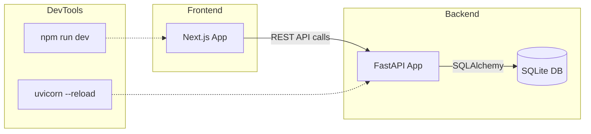

# Application Architecture & Tech Stack

> **Overview**
> This document outlines the overall architecture of the **InternshipIQ** project, the technologies used, and the end‑to‑end workflow for development, testing, and deployment.

---

## 📦 Tech Stack

| Layer | Technology | Reasoning |
|-------|------------|-----------|
| **Frontend** | **Next.js (custom build)**<br>**React 18**<br>**TypeScript**<br>**Vite (dev server)** | Modern UI, server‑side rendering, fast hot‑module reload. The project uses a custom Next.js variant – see `node_modules/next/dist/docs/` for the exact API surface. |
| **Styling** | **Vanilla CSS** with **CSS Modules** and **Google Fonts (Inter)** | Full control over design, no Tailwind dependency as per guidelines. |
| **Backend** | **FastAPI** (Python 3.11)<br>**Uvicorn** (ASGI server) | High‑performance async API, automatic OpenAPI docs, easy integration with Pydantic models. |
| **Database** | **SQLite** (via **SQLAlchemy 2.x** ORM) | Lightweight, file‑based storage suitable for a prototype/intermediate‑scale app. |
| **Migrations** | **Alembic** | Handles schema evolution without downtime. |
| **Testing** | **PyTest** (backend) <br> **Jest + React Testing Library** (frontend) | Unit & integration testing for both sides. |
| **Containerisation** | **Docker** (Dockerfile & docker‑compose) | Reproducible dev & prod environments. |
| **CI/CD** | **GitHub Actions** | Lint, test, build, and deploy on push/PR. |
| **Version Control** | **Git** | Source history and collaboration. |

---

## 🏗️ Architecture Diagram



---

## 🔄 Development Workflow

1. **Clone the repo** and install dependencies:
   ```bash
   git clone <repo-url>
   cd InternshipIQ
   npm install   # frontend deps
   pip install -r backend/requirements.txt   # backend deps
   ```
2. **Start the backend** (watch mode):
   ```bash
   cd backend
   uvicorn app.main:app --port 8000 --reload
   ```
3. **Start the frontend** (hot reload):
   ```bash
   npm run dev
   ```
4. **Work on features** – edit files under `src/` (frontend) or `backend/app/` (backend). Hot‑reload will reflect changes instantly.
5. **Run tests**:
   - Frontend: `npm test`
   - Backend: `pytest`
6. **Commit & push** – CI runs lint, tests, and builds the production bundle.
7. **Deploy** – Docker image is built and pushed to the registry; the production server runs `npm start` & `uvicorn` without `--reload`.

---

## 📂 Repository Layout

```
/ (root)
├─ public/                # static assets
├─ src/                   # Next.js source (pages, components)
├─ backend/               # FastAPI source
│   ├─ app/               # API routers, models, schemas
│   ├─ alembic/           # DB migrations
│   └─ requirements.txt
├─ .env.local            # local env variables (frontend)
├─ .env                  # backend env variables
├─ package.json           # frontend deps & scripts
├─ tsconfig.json          # TypeScript config
└─ APP_ARCHITECTURE_AND_TECH_STACK.md  # **this file**
```

---

## 🛠️ How Tech Is Used

- **Next.js**: Handles routing, SSR, and static file serving. Custom API routes (if any) live under `src/pages/api/`.
- **React + TypeScript**: Provides type‑safe UI components; state is managed with hooks and context.
- **Vanilla CSS**: Scoped via CSS Modules, ensuring no global style bleed.
- **FastAPI**: Exposes REST endpoints consumed by the frontend. Uses Pydantic for request validation.
- **SQLAlchemy**: ORM layer abstracts SQLite queries; models are defined in `backend/app/models.py`.
- **Alembic**: Generates migration scripts (`alembic/versions/`). Run `alembic upgrade head` after model changes.
- **Docker**: `Dockerfile` builds a multi‑stage image – the first stage builds the Next.js app, the second stage runs the FastAPI service.
- **GitHub Actions**: Workflow file `.github/workflows/ci.yml` runs on push/PR, performing lint, test, and Docker build steps.

---

## 🚀 Production Checklist

- [ ] Environment variables are set (`.env` & `.env.local`).
- [ ] Database migrations are up‑to‑date (`alembic upgrade head`).
- [ ] Docker image is built and pushed.
- [ ] Static assets are pre‑rendered (`npm run build`).
- [ ] Uvicorn runs without `--reload`.

---

*Document last updated: 2026‑06‑18*
