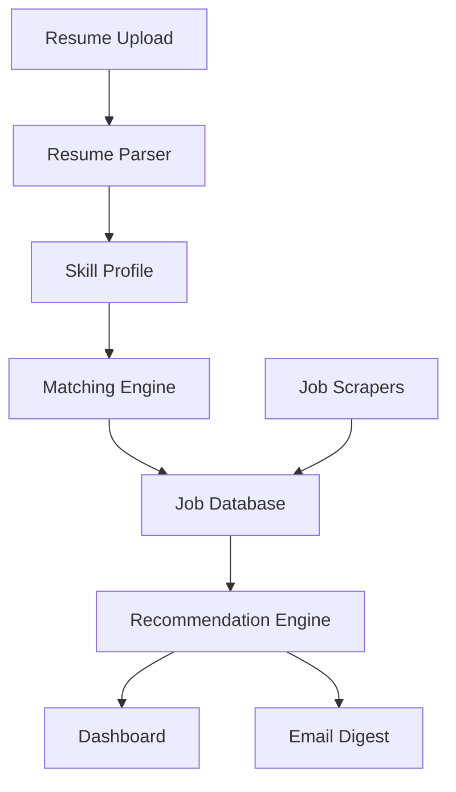

<div align="center">

# InternshipIQ


<br/>


</div>

---

## 🎯 Vision

InternshipIQ helps students discover internships that actually match their skills and career goals.

Instead of manually searching multiple portals, InternshipIQ:

- 📄 Parses resumes
- 🎯 Scores opportunities
- 📊 Identifies skill gaps
- 📧 Sends daily recommendations
- 🔍 Aggregates internships from multiple sources

---

## ⚡ Feature Overview

| Feature | Status |
|----------|----------|
| Resume Parser | 🟢 |
| AI Matching | 🟢 |
| Job Aggregation | 🟢 |
| Authentication | 🟡 |
| Email Digest | 🟡 |
| Analytics Dashboard | 🟢 |
| Premium Features | 🟡 |

---

## 🏗 Architecture



---

## 📊 Current Progress

### Backend


### Frontend


### Scrapers


### AI Features


---

## 🔥 Core Modules

### Resume Intelligence

```text
Resume
↓
Skill Extraction
↓
Technology Detection
↓
Experience Analysis
↓
Profile Generation
```

### Matching Engine

```text
Resume Match
+
Skill Match
+
Experience Match
+
Preference Match
=
Overall Score
```

---

## 🛠 Tech Stack

Frontend

```yaml
Next.js
React
TypeScript
TailwindCSS
```

Backend

```yaml
FastAPI
SQLAlchemy
PostgreSQL
Alembic
```

AI

```yaml
Claude
Resume Analysis
Matching Engine
Skill Gap Detection
```

Infrastructure

```yaml
Docker
GitHub
Vercel
Railway
```

---

## 📈 Roadmap

### Phase 1

- [x] Landing Page
- [x] Job Listings
- [x] Resume Upload
- [x] Analytics Dashboard

### Phase 2

- [ ] Authentication
- [ ] Premium Plans
- [ ] Daily Email Digest

### Phase 3

- [ ] ATS Score
- [ ] AI Career Coach
- [ ] Auto Apply System

---

## 👨‍💻 Builder

### Aarupadaiyar KJ

Data Analyst • Software Developer • Builder of InternshipIQ

Focused on:

- AI Products
- Data Analytics
- Automation
- Career Intelligence

---

<div align="center">

⭐ Star this repository if you like the idea.

Built with ❤️ by Aarupadaiyar KJ

</div>
